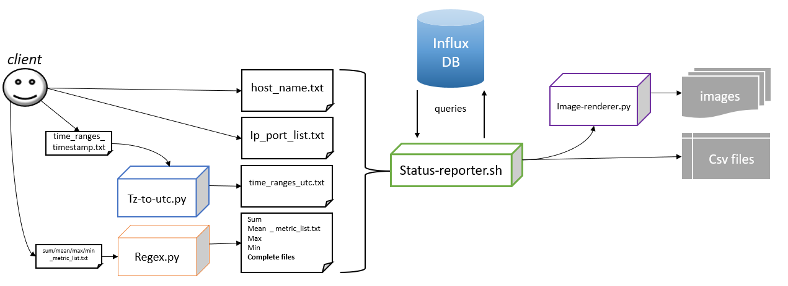

# status-reporter
influxdb API tool for sending query automatically and save some documents for monitoring. 

       related to these projects: https://github.com/m-taghva/influxdb.git
       # This program has an integrated structure and its modules are interdependent and work together #
       schema:
       
