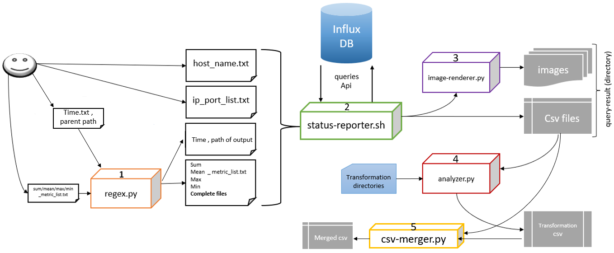

# status-reporter
<h4>influxdb API tool for sending query automatically and save some documents for monitoring.</h4>
<h4># This program has an integrated structure and its modules are interdependent and work together #</h4>
workload schema:

related to these projects: https://github.com/m-taghva/influxdb.git
 step by step usage: 
   
    - Install dependencies:
        # apt install jq / yum install jq 
          # pip install pytz datetime matplotlib pandas tqdm  
    ======================================================
    - put your time range in time_rangs_taimestamp.txt like this format: 2023-07-31 09:30:00,2023-07-31 10:30:00
    - put your monitored host or VM name in host_names.txt like this: name (line by line)
    - write ip and port of influxdb in ip_port_list.txt like this: localhost:8086
    - write your metric file like this: netdata.system.cpu.system (measurment line by line - you can use regex by \\w* in names)
    - your metric file prefix can use as expressions
    - you can change DB name on top code of the scripts. 
    - you need to give time and metric files and customize path to query_result for saving outputs.
    ======================================================
    - after complete all files start app with this command:
        (optional) #./status-reporter.sh metric_list.txt,time.txt,path to query_result
        # python3 regex.py mean_metric_list,sum_metric_list, ... ,time_ranges_utc.txt,path to query_result
    ======================================================
    - analyzer can work separately and manually :
        # python3 analyzer.py /csv-path  transformation-directory
    - in analyzer you can do sum or avg on csv columns and make new csv with transformation.
    - make t*.txt file for selecting columns and transform operation. 
    - first line of these files is operastin-new column name like : sum-my.cpu
    - other lines are selected columns.
    - new file is made in input csv directory and name is orginal csv name-transformation directory.csv
    ======================================================
    - csv-merger.py is a experimental script and just use in some situations.
    - usage:
        # python3 csv-merger.py <path to parent of all query_results>
    - it can include directory name in to the merged of all csv.
